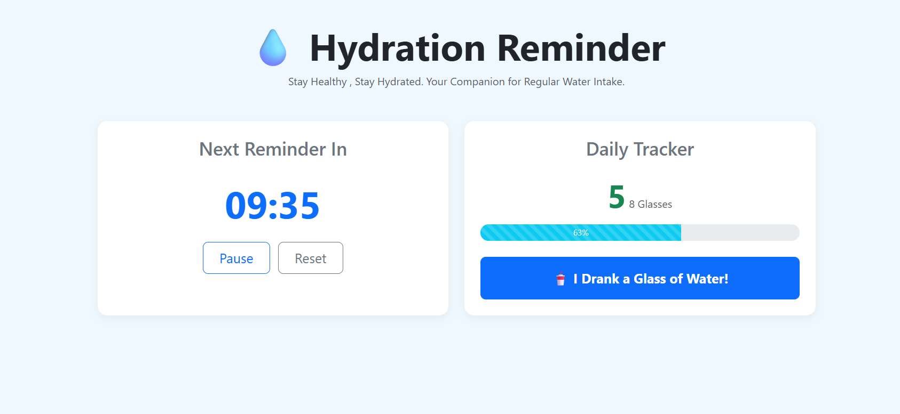
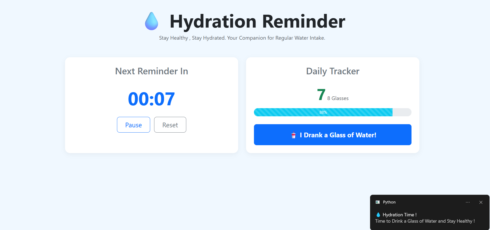

# 💧 Hydration Reminder : Flask Water Intake Tracker 

Hydration Reminder is a Full Stack Python Web Application designed to Help Users Stay Hydrated throughout the Day. Built with a Flask Backend and a Responsive Bootstrap Frontend, it features an interactive Live Countdown Timer, Desktop Notifications, and a Dynamic Daily Progress Tracker. 

 

 

---

## 🚀 Features 

- **Interactive Dashboard :** Modern , Clean UI built with Bootstrap 5.
- **Live Countdown Timer:** Frontend Timer that updates seamlessly without page reloads.
- **Desktop Notifications:** Asynchronous API triggers that use the `plyer` library to send Native Desktop Alerts.
- **Daily Progress Tracker:** Visually Interactive Progress Bar to track your daily Hydration Goals.

---

## 🛠️ Tech Stack

- **Backend:** Python, Flask
- **Frontend:** HTML5, CSS3, JavaScript (Fetch API), Bootstrap 5
- **OS Notifications:** Plyer

---

## 📦 Installation & Setup 

Follow these Steps to Run the Application locally on your Machine : 

### 1. Clone the Repository 
```bash
git clone [https://github.com/Ashutosh-io7/Water-Reminder-App.git](https://github.com/Ashutosh-io7/Water-Reminder-App.git)
cd Water-Reminder-App
```

### 2. Install Dependencies
Make Sure You have Python Installed , then Run : 
```bash 
pip install -r  requirements.txt
```

### 3. Run the Flask Server 
```bash 
python app.py
``` 

### 4. Access the App 
Open your Web Browser and Navigate to : 
[http://127.0.0.1:5000/](http://127.0.0.1:5000/) 
